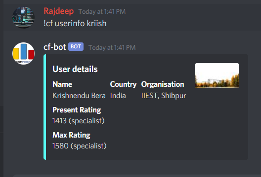

# CF Bot

Gets the happening around in CF using the codeforces api


### !cf help


### !cf future 2 


### !cf userinfo Rajdeep2k


### !cf userinfo kriish




### !cf lastcontest arnab1729


## Development:

```bash
$ git clone https://github.com/Rajdeep-G/Cf-bot

$ cd CTFBot
```

### Pre-requisites

1. Create your bot for testing [here](https://discord.com/developers/)
2. Copy the TOKEN and create an `.env` file and paste the token
3. Then follow these steps

```bash

$ npm i

$ npm run dev # for development

$ #edit bot.js for changes

```

## File an issue if you find any bug, cheers
